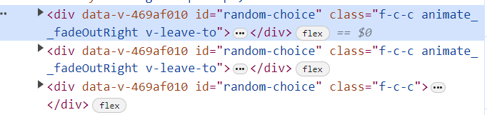

### 问题：开发环境下修改代码，热更新时会添加多个当前的组件?

### 复现方法：在文本框中输入内容，然后修改组件内容保存后回到浏览器，查看组件所在的 dom 结构，可以发现重复渲染。如果不在文本框输入内容，修改代码不会出现问题。

_目前看来应该是 transition 部分，我哪里代码写错了？_

问题截图：

---

### 该问题已解决：该问题是否能够在生产环境产生我无法验证，但是开发环境确实会造成影响。我在子组件中声明了一个模板引用 `ref="allStr"` | `const allStr = ref(null);`，不管是否使用该引用都会造成问题的出现，当在组件卸载前重置它 `allStr.value = null;`，就不会出现问题了。

_但是，为什么会这样我不清楚 😵_

---

_translate:_

### When modifying the code in the development environment, multiple instances of the current component are added during hot reloading.

### Steps to reproduce the issue in the current demo: Enter some content in the text box, then modify the content of the component and save it. Go back to the browser and examine the DOM structure of the component. You will notice duplicate rendering. However, if no content is entered in the text box, modifying the code does not cause any issues.

_It seems that the issue lies in the transition section. Where did I make a mistake in the code?_

### solution: beforeUnmount reset 'Template Refs'
